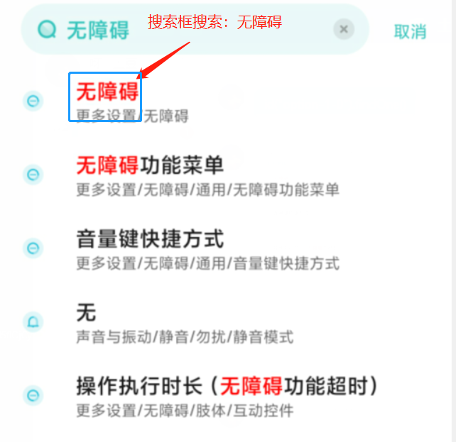
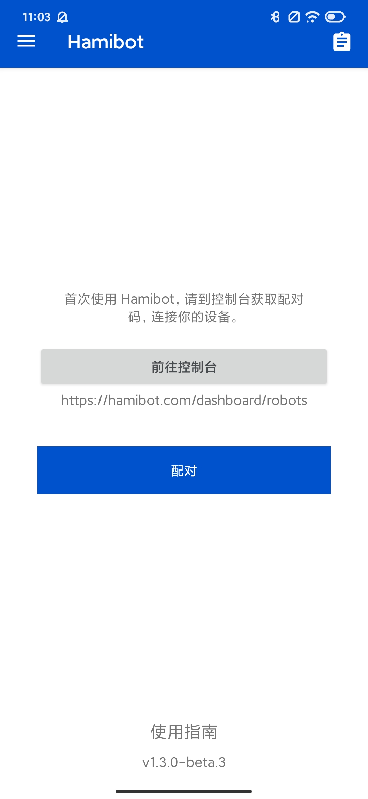

# With Hamibot

# 🧩介绍

软件下载

[邀请加入 · Hamibot 安卓自动化工具](https://hamibot.com/referrals/enpp)

脚本链接

[脚本市场 · Hamibot 安卓自动化工具](https://hamibot.com/marketplace/1bvMC)

---

# 🌟 使用指南

使用须知：此脚本仅在Android端可行，需开启Hamibot无障碍模式

[官方指南](https://hamibot.com/guide)

先注册Hamibot账户。

1. 将Hamibot开启无障碍模式。
   
   
    
    
    
    
    
    
1. Hamibot机器配对

- 点击前往控制台
- 点击添加机器人，这时出现配对码，将配对码复制
- 返回Hamibot界面
- 点击配对

配对好后，进入控制台的脚本栏，便可开始运行。

1. 脚本配置

若未配置用户名或密码，在需要登录时请自行登录！

---

# ✅ 功能

- [x]  考勤打卡
    - [x]  无填报实习单位
    - [ ]  填报实习单位后的打卡
- [ ]  后端上传打卡数据
    - [ ]  虚拟定位
    - [ ]  定时打卡
    - [ ]  周报实现

