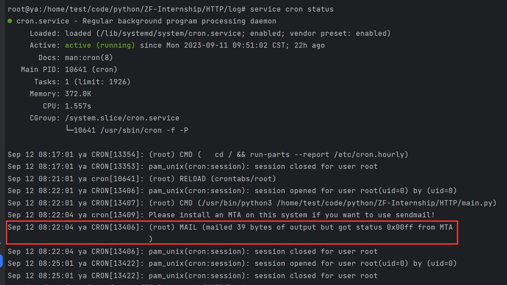
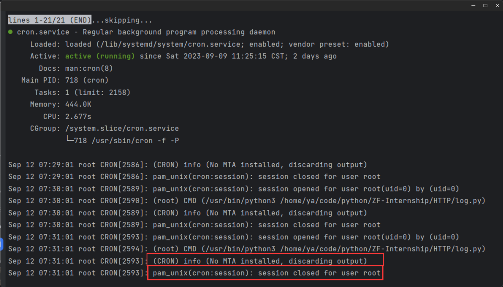
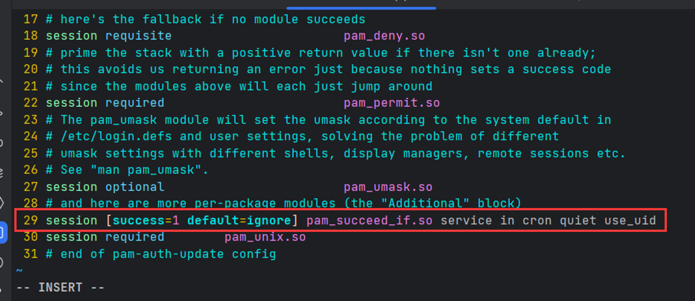

# Use HTTP (已完成)

# 🪶 特征

- [x]  虚拟定位
- [x]  定时打卡
- [x]  上传周报
- [x]  多用户实现
- [x]  获取当天打卡情况

# 📜 使用指南

## 🛖 项目结构

```
├─main.py 主函数
├─README.md
├─report.txt 周报数据
├─zf_internship.sql 数据库文件
├─log 日志文件
|  └2023-9-5.log
├─function 功能函数
|    ├─data.py
|    ├─glo.py
|    ├─log.py
|    ├─sendEmail.py
|    ├─sql.py
|    ├─state.py
|    ├─__init__.py
├─file README照片
```

# 👉需要做的

1. 执行`sql.py`文件
   - 插入用户信息(包含学号、登录密码、邮箱)、打卡地址信息 

	2. 更改`data.py`文件

```python
loginURL = ""  # 登录地址
signURL = ""  # 打卡地址
singPageUrl = ""  # 打卡页面地址
singInfoUrl = ""  # 打卡信息地址
reportURL = ""  # 周报上传地址
```

3. 插入周报 `data.py`的`reportExecute()`函数 ->  非必要

## 服务器定时执行

若需要定时打卡而不是每次打卡都是自己执行，需拥有一台服务器( [阿里云飞天计划](https://developer.aliyun.com/plan/student) 可免费获取七个月服务器使用 )  


下面程序表明，每天8:21执行指定程序

```shell
21 8 * * * /usr/bin/python3 /home/test/code/python/ZF-Internship/main.py
```

再查看cron运行状态，显示了上传的数据内存，同时查看log文件200 打卡成功  




无法执行错误： 

```shell
service cron status
```



表明系统未安装邮箱服务，执行：`sudo apt-get install postfix`

下载完成后，会弹出紫色界面，选择OK，然后选择最后一个Locate，本地位置，后面的直接OK就好不必更改。

```shell
vim /etc/pam.d/common-session-noninteractive
# 将下面内容增加到30行
session [success=1 default=ignore] pam_succeed_if.so service in cron quiet use_uid  
```



重启crontab服务：`service cron restart`

[参考链接](https://askubuntu.com/questions/222512/cron-info-no-mta-installed-discarding-output-error-in-the-syslog)


---

**打卡系统有开放时间！！！一定要在开放时间内启动或完成打卡（早上7:00分开启，晚上22:00关闭）** 

💝 心得

本次的程序编写多了解了些有关HTTP请求的方式与数据交互，若在没有人实现该功能的情况下如何编写，如何查找资料以及最重要的实现原理与逻辑！  也花了自己很多时间与精力，备考内容落下许多，优先级似乎被我遗忘了（编程太让我入迷）

---

# 🔗 参考链接

[Requests: HTTP for Humans™ — Requests 2.31.0 documentation](https://requests.readthedocs.io/)

[拾取坐标系统](https://lbs.amap.com/)

[datetime — Basic date and time types](https://docs.python.org/3/library/datetime.html)