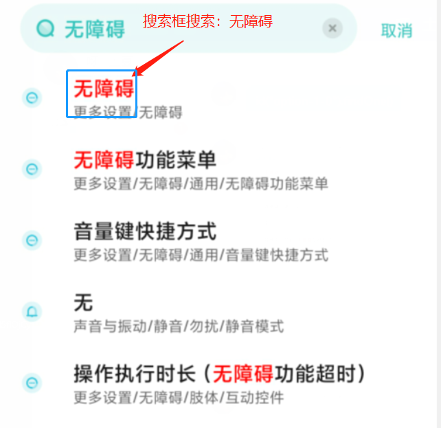
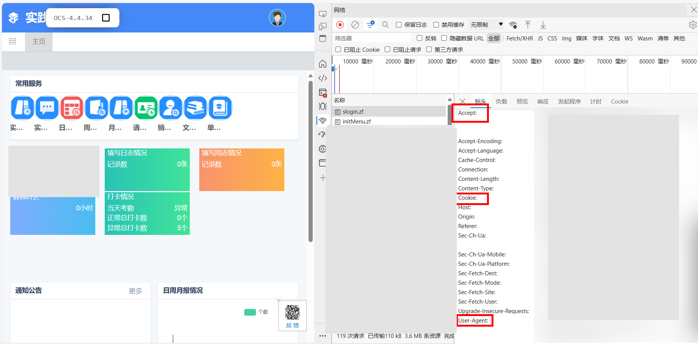
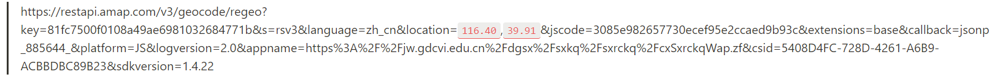

# Use HTTP (已完成)

# 📜 使用指南

## 🛖 项目结构

- log
    - 日志文件
- use
    - 使用情况 (待)
- data.py
    - 数据
- log.py
    - 日志
- main.py
    - 主函数



只需要修改data.py文件内容即可：

- header  ——> 头文件
    - `User-Agent`
    - `Cookie`
    - `Accept`
- user  ——> 用户信息
    - `ZFTAL_CSRF_TOKEN`
    - `yhm`
    - `mm`
    - `id`
- state  ——> 地理位置
    - `longitude`
    - `latitude`
    - `location`

## 😶‍🌫️ Header获取

- 打开浏览器，进去登陆网址(处于非登陆状态)、按下F12或右击鼠标点击检查
- 点击网络、全部
- 输入账号密码登录、在网络处找到slogin.zf的文件、查看需要的header数据并复制到data.py文件中


打开浏览器，进去登陆网址(处于非登陆状态)、按下F12或右击鼠标点击检查


点击网络、全部


输入账号密码登录、在网络处找到slogin.zf的文件、查看需要的header数据并复制到data.py文件中



## 👤 user用户信息获取

用以登陆的用户名和密码对应填写即可，如用户名和密码均为123456，不必填写该网址加密后的密文。   

同样在slong.zf内，里面的**`ZFTAL_CSRF_TOKEN`** 对应填写

**iD的获取有两种方式。**

不要关闭F12打开的界面 / 控制台获取id还需要   ———>  建议是打断点获取，这样不会签到成功，当然也可以直接点击签到获取id值，无妨。

1. 不打断点（未打卡状态） 获取id

点击签退 / 签到，然后直接就能看到inRange,zf和sign.zf，任意一个点击负载查看即可。


1. 打断点（已打卡显示签退状态）获取id
- 鼠标右击签退按钮，获取签退的id：`btn-sign-out`  你也可以直接复制
- 按住键盘Ctrl+shift+F打卡全局搜索
- 打断点
- 点击签退


## 🎑 state数据获取

见下方注意事项

---

修改好后运行main.py文件即可。

你可以使用Pycharm、Poweshell(有时称作命令行)、Linux均可。

- Pycharm： 配置好Python环境点击运行 / Ctrl + shift + F10即可
- Poweshell: 进入当项目目录，执行（Linux同）:

```powershell
python3 main.py
```

在执行前你还需要阅读🚨注意事项

---

# 🚨 注意事项

data.py文件的state类一定要确认好再运行程序。 

```python
"""
地点信息
"""
class state():
    # 数据获取: https://api.map.baidu.com/lbsapi/getpoint/
    # 建议经纬度为六位小数，能够匹配打卡信息
    longitude = 0  # 打卡经度
    latitude = 0  # 打卡维度
    location = ""  # 打卡地点

    # 如果你已填报实习地点，并且获取的经纬度为实习地点附近，需将 'zkqfw'类型更改为1
    datas = {
        "mbjd": "{:.2f}".format(longitude - 0.75),
        "mbwd": "{:.2f}".format(latitude + 0.65),
        "yxwc": 500,
        "kqjd": longitude,
        "kqwd": latitude,
        "kqddxx": location,
        "rwxm_id": user.id,  # 用户id: 每个账号都是唯一的，需抓包获取
        "kqlx": 0,   # 考勤类型: 0 -> 签到,1 -> 签退
        "zkqfw": 0,  # 在考勤范围: 0 -> 否, 1 -> 是
    }
```

你需要注意哪些方面？

1. location的地点信息
   
    请将下面标注出`location`内的两个参数更改打卡的经纬度 ([点击获取经纬度](https://api.map.baidu.com/lbsapi/getpoint/))，然后输入到浏览器内查看，获取`‘formatted_address’` 后面的地址信息同时去除掉省、市级。如：北京市东城区东华门街道五色门北京市劳动人民文化宫，只取：东华门街道五色门北京市劳动人民文化宫。
    
    
    
    ```html
    https://restapi.amap.com/v3/geocode/regeo?key=81fc7500f0108a49ae6981032684771b&s=rsv3&language=zh_cn&location=116.40,39.91&jscode=3085e982657730ecef95e2ccaed9b93c&extensions=base&callback=jsonp_885644_&platform=JS&logversion=2.0&appname=https%3A%2F%2Fjw.gdcvi.edu.cn%2Fdgsx%2Fsxkq%2Fsxrckq%2FcxSxrckqWap.zf&csid=5408D4FC-728D-4261-A6B9-ACBBDBC89B23&sdkversion=1.4.22
    ```
    
    
    
2. zkqfw 是否在考勤范围
   
    如何判定该打卡的区域是否在考勤范围呢？以下三种情况
    
    - 如果你填写了实习地点，但你要打卡的地点不在实习地点的范围则不在考勤范围（不必更改）：0
    - 如果填写了实习地点，且打卡的地址跟实习地点相同则要更改为：1
    - 若没填写实习地点：0

为避免非本校生获取到本公开后的项目而对实习网址进行攻击，所以项目地址被我清空，而放在这里，请获取到本项目后分享到网络上时请一并删除网站地址！

---

# 🔗 参考链接

[Requests: HTTP for Humans™ — Requests 2.31.0 documentation](https://requests.readthedocs.io/)

[拾取坐标系统](https://api.map.baidu.com/lbsapi/getpoint/)

[坐标信息](https://restapi.amap.com/v3/geocode/regeo?key=81fc7500f0108a49ae6981032684771b&s=rsv3&language=zh_cn&location=116.40,39.91&jscode=3085e982657730ecef95e2ccaed9b93c&extensions=base&callback=jsonp_885644_&platform=JS&logversion=2.0&appname=https%3A%2F%2Fjw.gdcvi.edu.cn%2Fdgsx%2Fsxkq%2Fsxrckq%2FcxSxrckqWap.zf&csid=5408D4FC-728D-4261-A6B9-ACBBDBC89B23&sdkversion=1.4.22)

[datetime — Basic date and time types](https://docs.python.org/3/library/datetime.html)